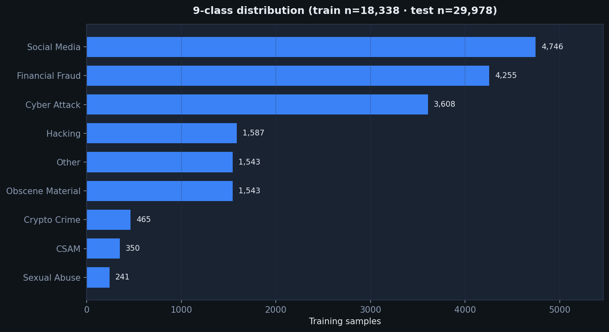
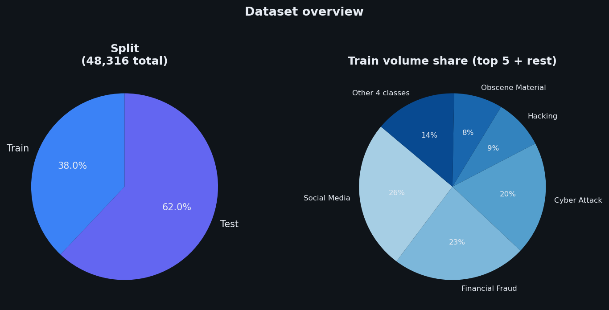
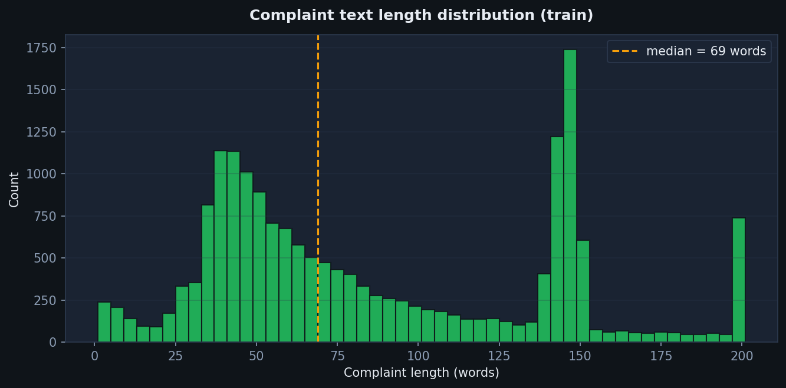
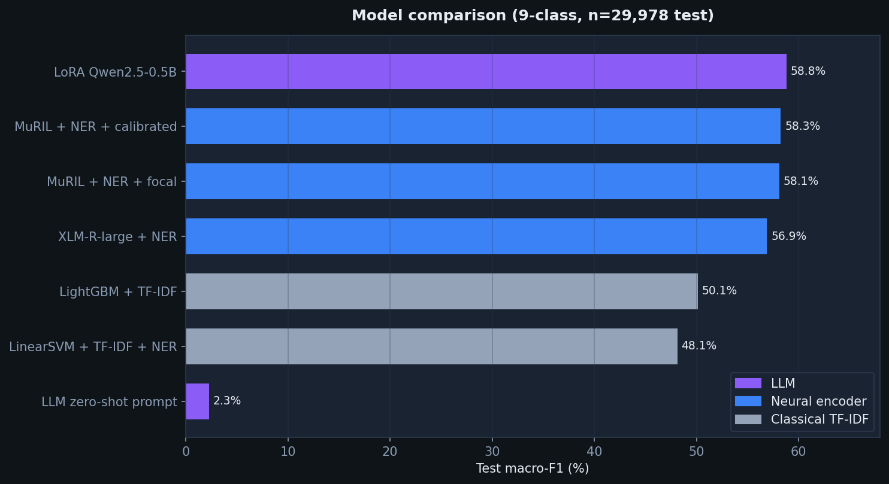
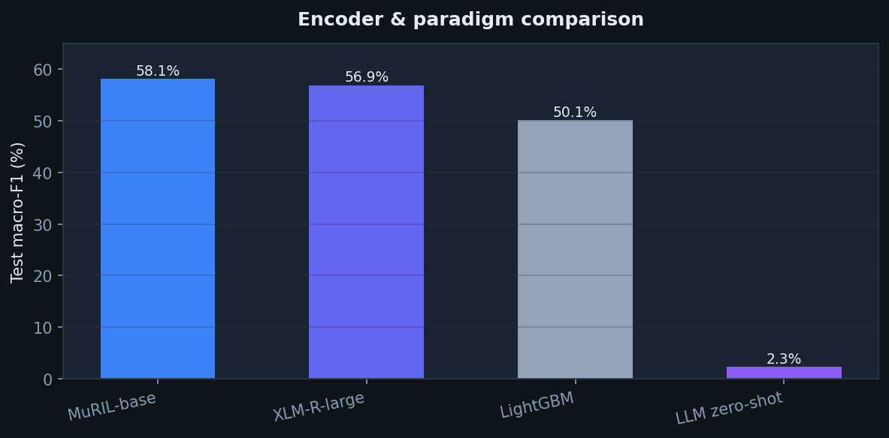
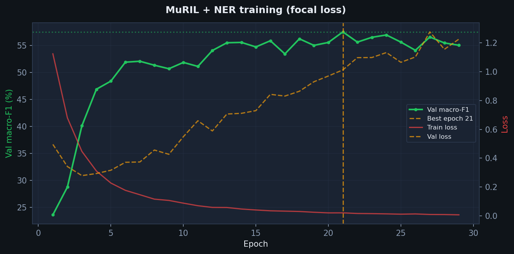
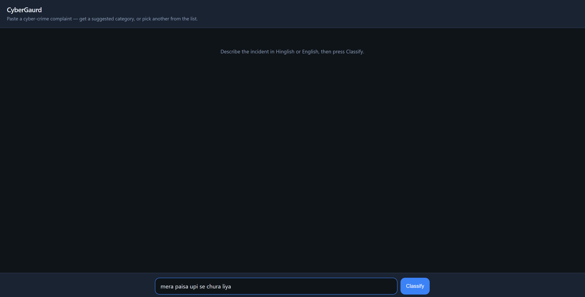
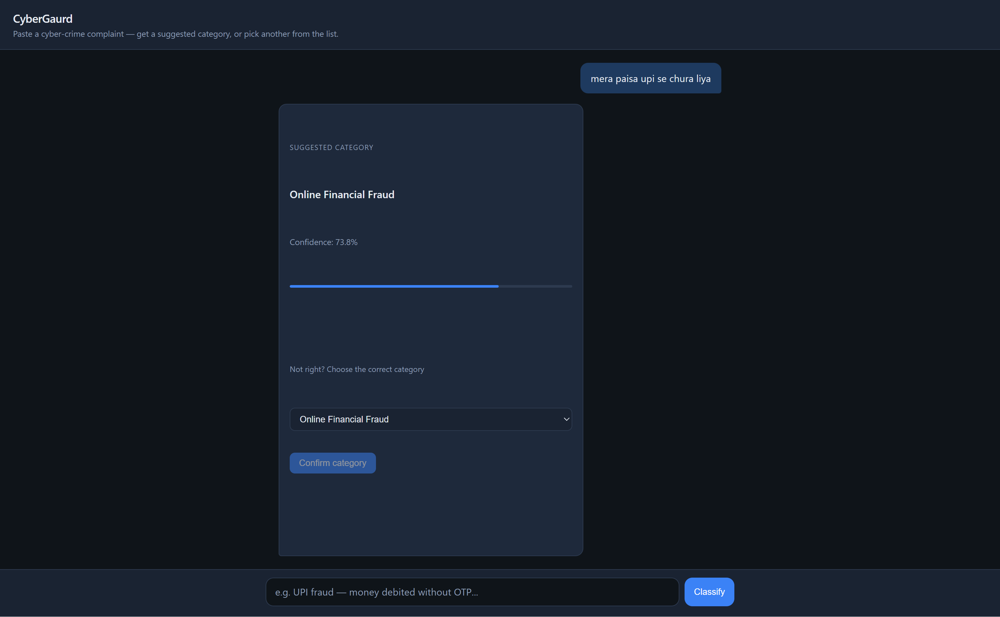

# CyberGaurd

**Multilingual cyber-crime complaint classifier** for romanized Hinglish / code-mixed Indian police reports. Compares classical ML, transformer encoders (MuRIL, XLM-R), and small-LLM fine-tuning — with a deployable inference API and chat-style review UI.

| | |
|---|---|
| **Best test macro-F1** | **58.8%** — LoRA Qwen2.5-0.5B (r=64) |
| **Deployed model** | **58.3%** — MuRIL-base + NER + calibration |
| **Dataset** | 18.3K train / 30K test · 9 categories |
| **Code** | [github.com/heller007/cybergaurd](https://github.com/heller007/cybergaurd) |
| **Weights** | [MuRIL checkpoint on Drive](https://drive.google.com/open?id=1xvHaKqB-kY8GB3cekO1CDGGCpZDYeJCK) |

📄 Full write-up: [`docs/EXPERIMENT_REPORT.md`](docs/EXPERIMENT_REPORT.md) · 📊 All metrics: [`outputs/experiments_9class/ablation_table.md`](outputs/experiments_9class/ablation_table.md)

---

## Problem

Cyber-crime complaints in India are often written in **noisy romanized Hinglish** (mixed Hindi–English, slang, typos). Automated **category triage** — routing a report to the right investigation queue — needs models that handle code-mixing and long-tail crime types.

CyberGaurd trains and benchmarks classifiers on a curated **9-class** label set (filtered from 11 classes with unreliable categories removed), with rule-based **NER features** (UPI IDs, bank names, social apps, etc.) fused into both classical and neural pipelines.

### Dataset

| Split | Samples |
|-------|---------|
| Train | 18,338 |
| Test | 29,978 |







---

## Results

**Primary metric:** category **macro-F1** on held-out test set (`n = 29,978`).

| Rank | Method | Test macro-F1 |
|------|--------|---------------|
| 1 | **LoRA fine-tune — Qwen2.5-0.5B** (r=64, α=128, 3 epochs) | **0.5880** |
| 2 | MuRIL-base + NER + focal + threshold calibration | 0.5826 |
| 3 | MuRIL-base + NER + focal loss | 0.5813 |
| 4 | XLM-R-large + NER + focal loss | 0.5692 |
| 5 | **LinearSVM + TF-IDF + NER** | **0.4813** |
| 6 | **LightGBM + TF-IDF** (SVD-300) | **0.5013** |
| 7 | LLM zero-shot prompting (Qwen2.5-0.5B) | 0.0227 |







**Takeaways**
- Fine-tuned small LLM edges MuRIL by **+0.5 pts** on full test; zero-shot LLM **fails** (~2% F1).
- MuRIL beats XLM-R-large by **+1.3 pts** on this Hinglish task.
- NER feature fusion adds **~2–3 pts** over text-only transformers.
- Filtering weak labels (11 → 9 classes) improved macro-F1 by **~8 pts**.

---

## Experimentation

| Track | What we ran |
|-------|-------------|
| **Classical** | TF-IDF (50k, 1–2 grams) + LinearSVM, LightGBM, LogisticRegression, MultinomialNB; with/without 28-dim NER features |
| **Transformers** | `google/muril-base-cased`, `xlm-roberta-large`; CLS + attention pooling; focal loss; weighted sampling |
| **Calibration** | Per-class probability thresholds tuned on validation set |
| **LLM** | Qwen2.5-0.5B zero-shot prompting vs LoRA (r=16, r=64) |
| **Ablations** | weak-class focal loss, max length 512, loss variants (focal / LDAM / cb_focal) |

Published metrics: [`outputs/experiments_9class/ablation_table.md`](outputs/experiments_9class/ablation_table.md)

---

## Architecture (deployed model)

```
Complaint text
    → clean_text + tokenize (MuRIL, max 256)
    → MuRIL encoder (CLS + attention pool)
    → concat 28-dim rule-based NER features
    → category head (9 classes)
    → optional per-class threshold calibration
```

```python
from src.predict_category import CategoryPredictor

predictor = CategoryPredictor()  # loads model/category_9class/
result = predictor.predict("UPI fraud — money debited without OTP")
print(result["category"], f"{result['confidence']:.1%}")
# Online Financial Fraud  91.6%
```

---

## Live demo (local)

Download model weights first (see [Model weights](#model-weights)), then:

```bash
pip install -r requirements.txt
uvicorn app.server:app --host 0.0.0.0 --port 8000
```

Open **http://localhost:8000**

| Input | Classification result |
|-------|----------------------|
|  |  |

- Paste a complaint → get **suggested category** + confidence
- **Dropdown** to override if the label is wrong
- Corrections logged to `data/feedback/corrections.jsonl`

---

## Quick start

```bash
git clone https://github.com/heller007/cybergaurd.git
cd cybergaurd
pip install -r requirements.txt

# Weights: see WEIGHTS.md (Google Drive)
```

---

## Model weights

**Not on GitHub.** Download from Google Drive:

**MuRIL deploy checkpoint (`best_model.pt`, ~915 MB):**  
https://drive.google.com/open?id=1xvHaKqB-kY8GB3cekO1CDGGCpZDYeJCK

```bash
mkdir -p model/category_9class
# Download best_model.pt from Drive → model/category_9class/best_model.pt
# Also copy cat_thresholds.npy + model_meta.json from releases/muril_category_9class/ if needed
```

Full details → [`WEIGHTS.md`](WEIGHTS.md)

| Model | Size | Path after download |
|-------|------|---------------------|
| MuRIL 9-class (deploy) | ~915 MB | `model/category_9class/best_model.pt` |
| LoRA Qwen2.5-0.5B r=64 | ~146 MB | `releases/llm_lora_qwen05b_r64/checkpoints/best_adapter/` |

```bash
pip install -r requirements.txt          # inference + UI only
pip install -r requirements-train.txt    # optional: re-training
```

---

## 9 categories

1. Online Financial Fraud  
2. Online and Social Media Related Crime  
3. Cyber Attack / Dependent Crimes  
4. Hacking / Damage to computer  
5. Sexually Obscene material  
6. Any Other Cyber Crime  
7. Cryptocurrency Crime  
8. Child Pornography / CSAM  
9. Rape/Gang Rape / Sexually Abusive Content  

Gambling and Sexually Explicit Act were dropped (test F1 &lt; 0.25 on 11-class models). See [`docs/DATASET_DESCRIPTION.md`](docs/DATASET_DESCRIPTION.md).

---

## Project structure

```
cybergaurd/
├── dataset_balanced_filtered/   # 9-class train/test CSVs
├── src/
│   ├── train_category.py        # MuRIL trainer
│   ├── predict_category.py      # Inference API
│   ├── ner.py                   # Rule-based NER (28-dim)
│   ├── llm_category.py          # LLM eval helpers
│   └── calibrate.py             # Threshold tuning
├── scripts/
│   ├── llm_lora_finetune.py     # LoRA fine-tune
│   ├── generate_readme_plots.py # README charts
│   └── build_ablation_table.py  # Aggregate published results
├── app/
│   ├── server.py                # FastAPI + feedback API
│   └── static/index.html        # Chat-style classifier UI
├── docs/
│   ├── images/                  # README plots (generate_readme_plots.py)
│   ├── EXPERIMENT_REPORT.md
│   └── DATASET_DESCRIPTION.md
└── outputs/experiments_9class/  # Published metric JSONs + ablation table
```

---

## License

Code is provided for research and portfolio use. Ensure compliance with dataset terms before training or deploying on real complaint data.
